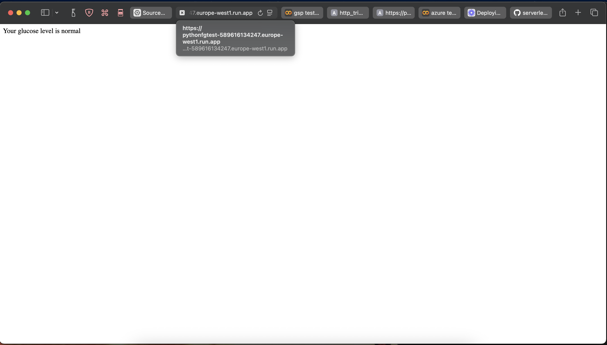
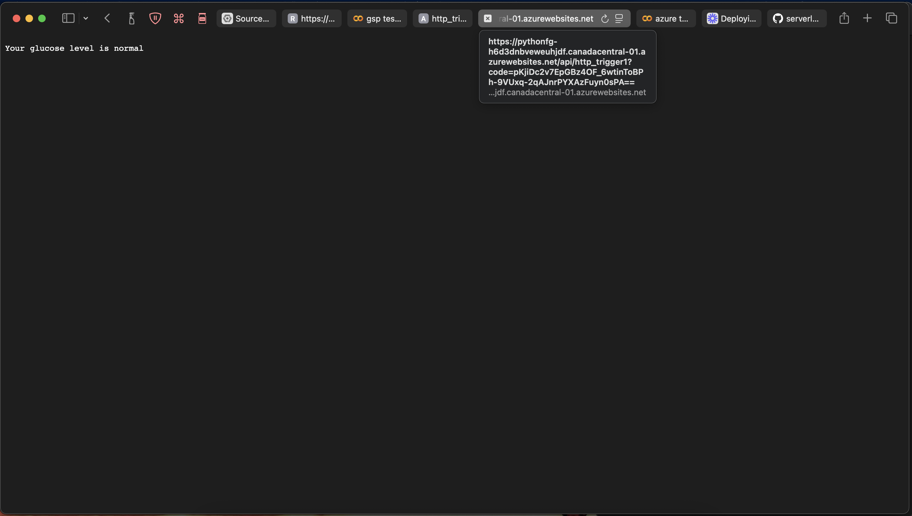

# Serverless Assignment

[Recording](https://www.loom.com/share/eab637ad0af9427d9732e881507fa3a8)

## Explanations and other material
- GCP and Azure Cloud were used for this assignment

## GCP
- Create function.
- Give the function a name.
- Runtime select Python.
- Allow public access checked.
- Request Based.
- Max instances: 1.
- Allow all ingress.
- Once deployed, edit your code and then save and redeploy.

## Azure Cloud
- Function App.
- Create and then select Consumption as the model used.
- Runtime select Python.
- Region is wherever.
- Review + crreate and wait for creation to complete.
- Go to resources once complete and create a function in the azure portal.
- Select http trigger.
- Authorization function + create.

## Screenshots
- GCP
- https://pythonfgtest-589616134247.europe-west1.run.app

- Azure
- https://portal.azure.com/#view/WebsitesExtension/FunctionTabMenuBlade/~/codeTest/resourceId/%2Fsubscriptions%2F494415ca-2b84-4171-9a6b-c4c43a6c532a%2Fresourcegroups%2FSchool%2Fproviders%2FMicrosoft.Web%2Fsites%2Fpythonfg%2Ffunctions%2Fhttp_trigger1

